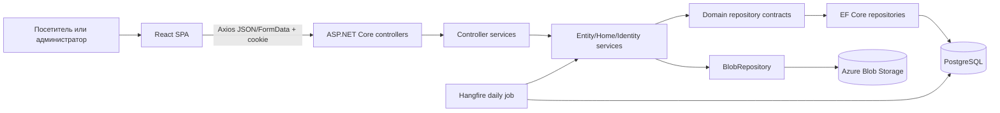

# Архитектура

## Приложения и слои

Frontend — одно React SPA, включающее публичные и admin screens. Backend solution состоит из:

- `StoronnimV.Api`: composition root, controllers, middleware, runtime configuration;
- `StoronnimV.Application`: controller services, entity services, DTO, validation, mapping, JWT/image/background logic;
- `StoronnimV.Domain`: entities, enums, projections и repository contracts;
- `StoronnimV.Infrastructure`: EF Context/repositories/migrations и Azure Blob adapter;
- `StoronnimV.Tests`: пустая xUnit-заготовка.

Зависимости проектов подтверждены `.csproj`: `Api → Application + Infrastructure`, `Application → Domain`, `Infrastructure → Domain`.

## Точки входа

- Frontend: [index.html](../../frontend/storonnimv.client/index.html) → [main.tsx](../../frontend/storonnimv.client/src/main.tsx) → [App.tsx](../../frontend/storonnimv.client/src/App.tsx) → [Page.tsx](../../frontend/storonnimv.client/src/components/pages/shared/Page.tsx).
- Backend: [Program.cs](../../backend/StoronnimV.Server/StoronnimV.Api/Program.cs), DI extensions — [WebApplicationBuilderExtensions.cs](../../backend/StoronnimV.Server/StoronnimV.Api/Extensions/WebApplicationBuilderExtensions.cs).

## Основной поток данных

Страница монтирует feature context и element. `useEffect` вызывает context function; она формирует URL через `GlobalContext.sendRequest`; controller делегирует controller service, затем entity service и repository. EF projection преобразуется AutoMapper в response DTO; context записывает результат в local state, UI рендерит list/modal/empty/loading state.

Admin mutations идут напрямую из form components через общий `sendRequest`, часто FormData для файлов. JWT хранится в HttpOnly cookie `Token`; frontend отдельно хранит строку роли в `sessionStorage` для route guard.

## API

Controller-based REST API разделён на public resources (`home`, `news`, `schedules`, `group`, `music`, `videos`, `group-socials`), identity (`account`), protected content mutations (`admin`) и SuperAdmin account management. Детальная таблица — [06_API_AND_DATA_FLOW.md](06_API_AND_DATA_FLOW.md).

## Хранение данных

PostgreSQL содержит 9 entity sets. Основные отношения: `Member 1—N Social` с cascade delete; `News 0—1 Video`. Остальные сущности независимы по snapshot. Файловые URL/имена сохраняются в сущностях, сами файлы обслуживает Azure Blob Storage.

## Внешние интеграции

- Azure Blob Storage: create/upload/delete blobs;
- PostgreSQL: application data, Hangfire storage, health check;
- Hangfire: daily schedule status update;
- клиентские embeds/links: ReactPlayer/Spotify and social URLs;
- Google Fonts и внешние placeholder images на video sections.

## Конфигурация

Не-секретные Cookie/RateLimiter settings читаются из `appsettings.json`; connection/JWT/CORS/blob — из environment. `.env` загружается только если файл существует в текущем process working directory. Frontend environment variable фактически не подключена.

## Ошибки и observability

`ExceptionMiddleware` переводит известные exceptions в HTTP status и возвращает `ex.Message` как plain text; неизвестные — 500. `LoggingMiddleware` пишет method/path/status. Serilog пишет errors в относительный `../logs/log.txt`. Health check проверяет API и PostgreSQL. Frontend в основном пишет errors в console или показывает browser alerts; централизованного error UI нет.

## Архитектурные несогласованности

- README runtime/env claims не совпадают с кодом.
- `VITE_API_URL` декларативно существует, но API base URL hardcoded.
- JWT services зарегистрированы, однако `UseAuthentication` отсутствует перед `UseAuthorization`.
- Hangfire dashboard подключён без видимой authorization policy.
- `DatabaseInitializer` изолирован и startup его не вызывает.
- AutoMapper profiles регистрируются через DI и отдельно создаётся ручной `MapperConfiguration` только ради validation; наборы profiles в двух местах могут расходиться.
- Client role guard основан на `sessionStorage`, а backend — на JWT role; это две разные истины.
- Границы Clean Architecture прагматические, не строгие: Application содержит infrastructure-oriented Hangfire/ImageSharp dependencies.

## Уверенность

Структура, dependencies, routes и статические разрывы — **подтверждено кодом**. Реальная доступность DB/blob, authentication behavior, cookie delivery, Hangfire и deployed routing — **требует запуска**.
